<div align="center">

# 📚 Bookly

### Your next favorite read is one tap away.

A sleek, dark-themed book reading & discovery app built with Flutter — designed for readers who want a fast, distraction-free way to track, discover, and manage their books.

<br/>


</div>

---

## ✨ Overview

**Bookly** is a modern mobile reading companion designed around a clean, dark UI with a warm coral accent. It focuses on three things: helping you **find** books worth reading, **track** your reading progress, and **manage your profile** without friction.

<br/>

<div align="center">

| Home | Search | My Books |
|:---:|:---:|:---:|
| 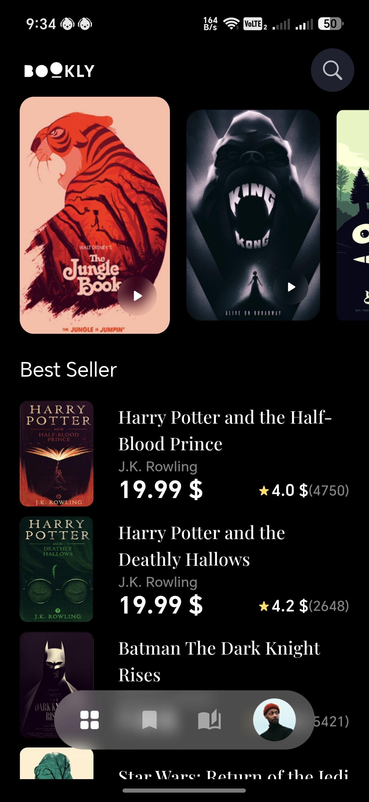 | 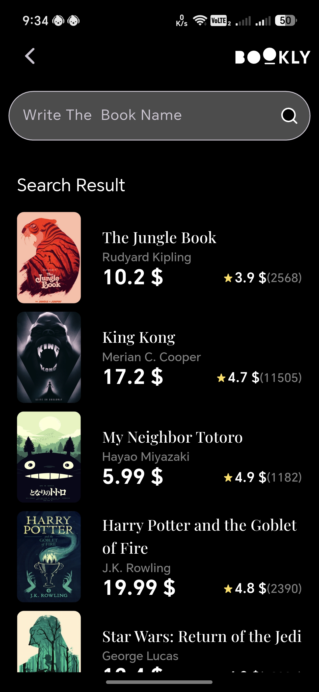 | 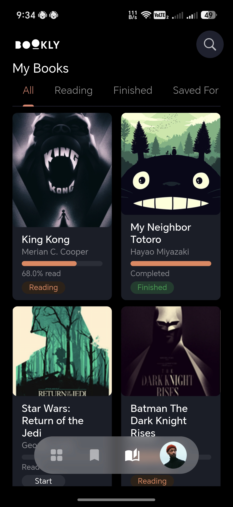 |

| Saved Books | Book Info | Profile |
|:---:|:---:|:---:|
| 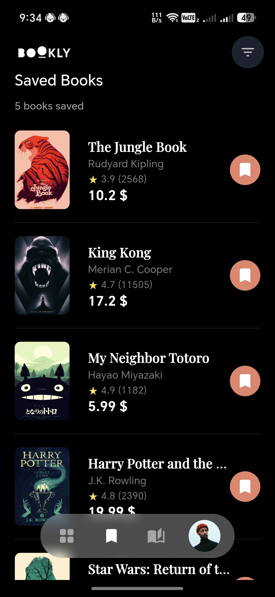 |  | 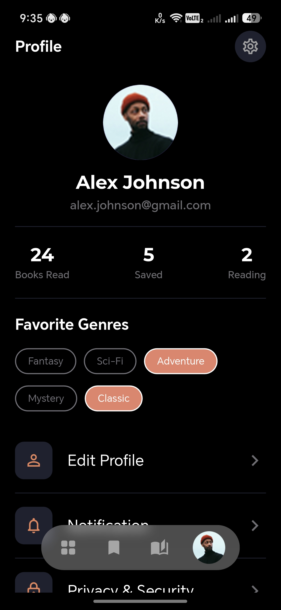 |

| Edit Profile | Notifications | Privacy & Security |
|:---:|:---:|:---:|
| 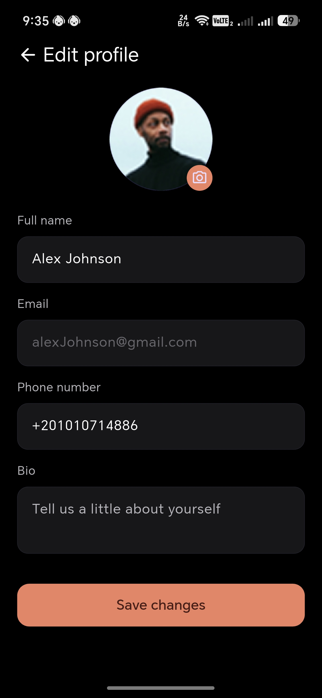 | 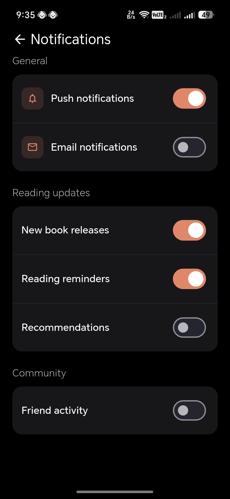 | 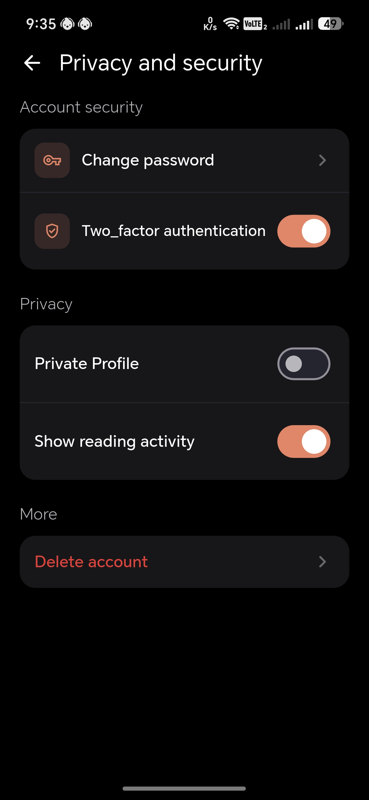 |

| Log In | Sign Up | OTP Verification |
|:---:|:---:|:---:|
| 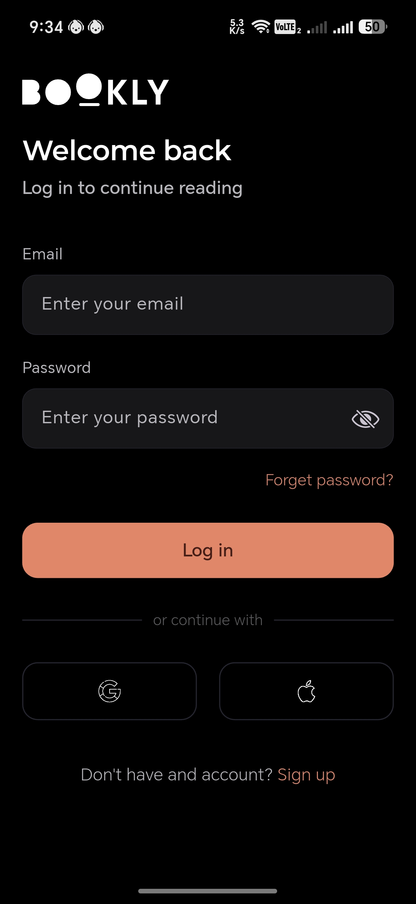 | 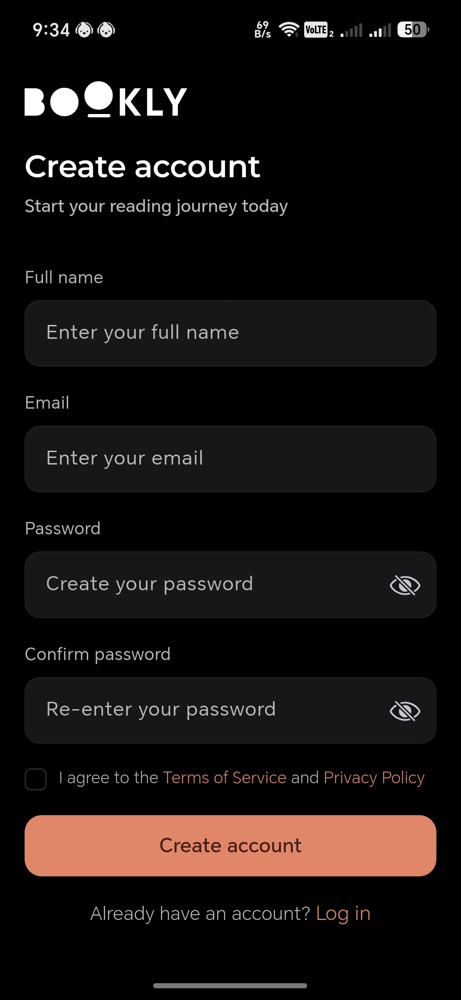 | 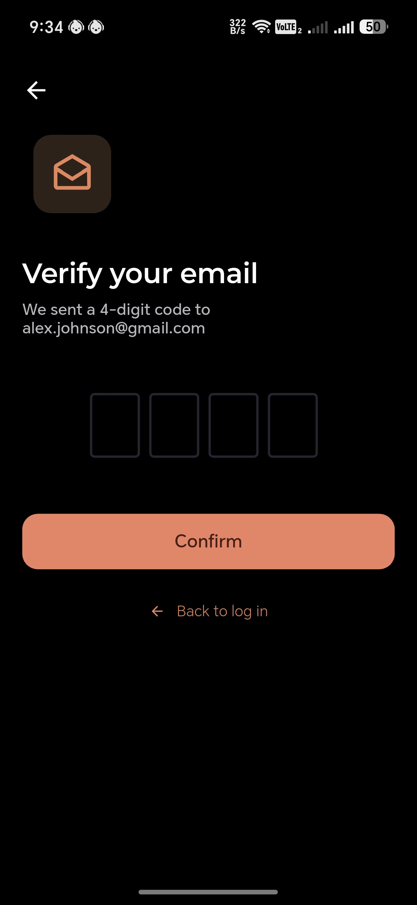 |

</div>

> 💡 Place your own `.jpg` screenshots in `assets/screenshots/` using the filenames above (or rename the `src` paths to match your own).

---

## 🚀 Features

- 🏠 **Home feed** — Browse curated and trending books at a glance
- 🔍 **Search** — Find books quickly by title, author, or genre
- 📖 **My Books & Saved Books** — Track what you're reading and bookmark what's next
- 📄 **Book info** — Detailed view for each book (synopsis, author, genre, etc.)
- 🔐 **Full authentication flow** — Log in, Sign up, Forgot password, and OTP email verification
- 👤 **Profile management** — View stats (books read, saved, currently reading), favorite genres, and edit personal info
- 🖼️ **Avatar upload** — Pick a profile photo from camera or gallery
- 🔔 **Granular notification settings** — Toggle push, email, and content-specific alerts by category
- 🔒 **Privacy & security controls** — Change password, two-factor authentication, private profile, and account management
- 🌙 **Distraction-free dark UI** — Consistent, custom design system across every screen
- 📱 **Fully responsive** — Built with `flutter_screenutil` so it looks right on any screen size

---

## 🛠️ Tech Stack

| Category | Tools |
|---|---|
| **Framework** | Flutter |
| **Language** | Dart |
| **State Management** | Cubit / Bloc (`flutter_bloc`) |
| **Routing** | `go_router` |
| **Responsive UI** | `flutter_screenutil` |
| **Image Picking** | `image_picker` |
| **Equality / Value comparison** | `equatable` |

---

## 📂 Project Structure

```
lib/
├── core/
│   ├── app/               # App-level setup (MaterialApp, routing, DI, etc.)
│   ├── data/               # Shared data layer (network, local storage, etc.)
│   ├── domain/             # Shared domain layer (entities, use cases)
│   ├── helper/             # Helper / utility functions
│   ├── resources/          # Colors, text styles, sizes, assets managers
│   └── widgets/            # Reusable widgets (CustomTextField, CustomButton, etc.)
├── features/
│   ├── auth/
│   │   ├── forget_password/
│   │   ├── log_in/
│   │   ├── otp/
│   │   └── sign_up/
│   ├── book_details/
│   ├── books_home/
│   ├── my_books/
│   ├── profile/
│   │   ├── edit_profile/
│   │   ├── manager/
│   │   ├── notifications/
│   │   ├── privacy_and_security/
│   │   └── views/
│   ├── saved_books/
│   ├── search_for_book/
│   ├── splash_screen/
│   └── user_book_details/
│       ├── book_reading/
│       ├── manager/
│       └── views/
├── generated/               # Auto-generated files (fonts, assets, etc.)
├── main.dart
└── try.dart
```

Each feature generally follows the same pattern: `views/` (pages + widgets) and `manager/` (Cubit + State), keeping UI and logic cleanly separated.

---

## ⚙️ Getting Started

### Prerequisites

- [Flutter SDK](https://docs.flutter.dev/get-started/install) (stable channel)
- A connected device or emulator

### Installation

```bash
# 1. Clone the repo
git clone https://github.com/your-username/bookly.git
cd bookly

# 2. Install dependencies
flutter pub get

# 3. Run the app
flutter run
```

### Permissions setup

Since Bookly uses the camera and gallery for avatar uploads, make sure to add:

**Android** — `android/app/src/main/AndroidManifest.xml`
```xml
<uses-permission android:name="android.permission.CAMERA"/>
```

**iOS** — `ios/Runner/Info.plist`
```xml
<key>NSCameraUsageDescription</key>
<string>Bookly needs camera access to update your profile photo.</string>
<key>NSPhotoLibraryUsageDescription</key>
<string>Bookly needs photo library access to update your profile photo.</string>
```

---

## 🎨 Design System

Bookly uses a consistent dark palette across the app:

| Token | Color |
|---|---|
| Background | `#000000` |
| Surface / Fields | `#17171A` |
| Border | `#2C2C2F` |
| Accent (Orange) | `#D85A30` |
| Primary Text | `#FFFFFF` |
| Secondary Text | `#9A9A9E` |

All shared UI pieces (`CustomTextField`, `CustomButton`, `CustomCheckbox`, `CustomOtpField`, `CustomNotificationTile`) live in `core/widgets/` and are built to be reusable across every screen.

---

## 🗺️ Roadmap

- [ ] Persist notification preferences with `shared_preferences`
- [ ] Book search & discovery screen
- [ ] Reading progress tracker
- [ ] Offline mode
- [ ] Localization

---

## 🤝 Contributing

Contributions are welcome! Feel free to open an issue or submit a pull request.

1. Fork the project
2. Create your feature branch (`git checkout -b feature/amazing-feature`)
3. Commit your changes (`git commit -m 'Add some amazing feature'`)
4. Push to the branch (`git push origin feature/amazing-feature`)
5. Open a Pull Request

---

## 📄 License

This project is licensed under the MIT License — see the [LICENSE](LICENSE) file for details.

---

<div align="center">

Made with 🧡 and Flutter

</div>
